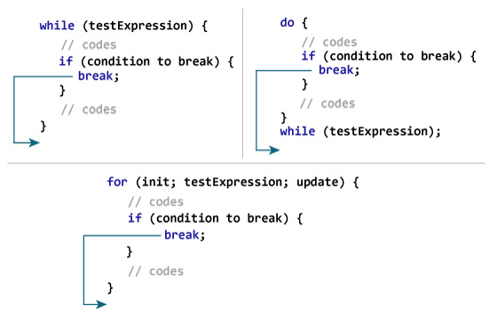

# 第5章：循环结构程序设计
## 5.1 循环类型
### **while循环**

C 语言中 while 循环的语法：
```c
while(condition)
{
   statement(s);
}
```
```c
#include <stdio.h>
 
int main ()
{
   /* 局部变量定义 */
   int a = 10;

   /* while 循环执行 */
   while( a < 20 )
   {
      printf("a 的值： %d\n", a);
      a++;
   }
 
   return 0;
}
```
### **for 循环**
C 语言中 for 循环的语法：
```c
for ( init; condition; increment )
{
   statement(s);
}
```
<ol class="list">
<li><b>init</b> 会首先被执行，且只会执行一次。这一步允许您声明并初始化任何循环控制变量。您也可以不在这里写任何语句，只要有一个分号出现即可。</li>
<li>接下来，会判断 <b>condition</b>。如果为真，则执行循环主体。如果为假，则不执行循环主体，且控制流会跳转到紧接着 for 循环的下一条语句。</li>
<li>在执行完 for 循环主体后，控制流会跳回上面的 <b>increment</b> 语句。该语句允许您更新循环控制变量。该语句可以留空，只要在条件后有一个分号出现即可。</li>
<li>条件再次被判断。如果为真，则执行循环，这个过程会不断重复（循环主体，然后增加步值，再然后重新判断条件）。在条件变为假时，for 循环终止。</li>
</ol>

```c
#include <stdio.h>
 
int main ()
{
   /* for 循环执行 */
   for( int a = 10; a < 20; a = a + 1 )
   {
      printf("a 的值： %d\n", a);
   }
 
   return 0;
}
```
### **do...while 循环**
C 语言中 do...while 循环的语法：
```c
do
{
   statement(s);

}while( condition );
```
循环中的 statement(s) 会在条件被测试之前至少执行一次

```c
#include <stdio.h>
 
int main ()
{
   /* 局部变量定义 */
   int a = 10;

   /* do 循环执行，在条件被测试之前至少执行一次 */
   do
   {
       printf("a 的值： %d\n", a);
       a = a + 1;
   }while( a < 20 );
 
   return 0;
}
```

## 5.2 循环控制语句
### **break语句**

```c
#include <stdio.h>
 
int main ()
{
   /* 局部变量定义 */
   int a = 10;

   /* while 循环执行 */
   while( a < 20 )
   {
      printf("a 的值： %d\n", a);
      a++;
      if( a > 15)
      {
         /* 使用 break 语句终止循环 */
          break;
      }
   }
 
   return 0;
}
```


### **continue 语句**


```c
#include <stdio.h>
 
int main ()
{
   /* 局部变量定义 */
   int a = 10;

   /* do 循环执行 */
   do
   {
      if( a == 15)
      {
         /* 跳过迭代 */
         a = a + 1;
         continue;
      }
      printf("a 的值： %d\n", a);
      a++;
     
   }while( a < 20 );
 
   return 0;
}
```

### **goto 语句**

C 语言中的 goto 语句允许把控制无条件转移到同一函数内的被标记的语句。

**注意**：在任何编程语言中，都不建议使用 goto 语句。因为它使得程序的控制流难以跟踪，使程序难以理解和难以修改。任何使用 goto 语句的程序可以改写成不需要使用 goto 语句的写法。

**C 语言中 goto 语句的语法：**
```c
goto label;
..
.
label: statement;
```


```c
#include <stdio.h>
 
int main ()
{
   /* 局部变量定义 */
   int a = 10;

   /* do 循环执行 */
   LOOP:do
   {
      if( a == 15)
      {
         /* 跳过迭代 */
         a = a + 1;
         goto LOOP;
      }
      printf("a 的值： %d\n", a);
      a++;
     
   }while( a < 20 );
 
   return 0;
}
```

## 5.3 循环嵌套
可以在任何类型的循环内嵌套其他任何类型的循环。

**嵌套 for 循环**

```c
for (initialization; condition; increment/decrement)
{
    statement(s);
    for (initialization; condition; increment/decrement)
    {
        statement(s);
        ... ... ...
    }
    ... ... ...
}
```
```c
#include <stdio.h>
 
int main ()
{ //下面的程序使用了一个嵌套的 for 循环来查找 2 到 100 中的质数：
   /* 局部变量定义 */
   int i, j;
   
   for(i=2; i<100; i++) {
      for(j=2; j <= (i/j); j++)
        if(!(i%j)) break; // 如果找到，则不是质数
      if(j > (i/j)) printf("%d 是质数\n", i);
   }
 
   return 0;
}
```
**嵌套 while 循环**
```c
while (condition1)
{
    statement(s);
    while (condition2)
    {
        statement(s);
        ... ... ...
    }
    ... ... ...
}
```
```c
#include <stdio.h>
int main()
{
    int i=1,j;
    while (i <= 5)
    {
        j=1;
        while (j <= i )
        {
            printf("%d ",j);
            j++;
        }
        printf("\n");
        i++;
    }
    return 0;
}
当上面的代码被编译和执行时，它会产生下列结果：

1
1 2
1 2 3
1 2 3 4
1 2 3 4 5
```

**嵌套 do...while 循环**
```c
do
{
    statement(s);
    do
    {
        statement(s);
        ... ... ...
    }while (condition2);
    ... ... ...
}while (condition1);
```
```c
#include <stdio.h>
int main()
{
    int i=1,j;
    do
    {
        j=1;
        do
        {
            printf("*");
            j++;
        }while(j <= i);
        i++;
        printf("\n");
    }while(i <= 5);
    return 0;
}
结果:
*
**
***
****
*****
```


[上一章](第4章：选择结构程序设计.md)&ensp;&ensp;&ensp;&ensp;&ensp;&ensp;[下一章](第6章：数组.md)