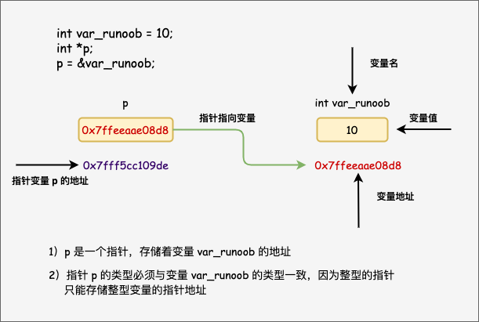

# 第8章：指针
## 8.1 指针和指针变量
### 指针的概念
每一个变量都有一个内存位置，每一个内存位置都定义了可使用` & `运算符访问的地址，它表示了在内存中的一个地址。
```c
#include <stdio.h>
 
int main ()
{
    int var_runoob = 10;
    int *p;              // 定义指针变量
    p = &var_runoob;
 
   printf("var_runoob 变量的地址： %p\n", p);
   // printf("var_runoob 变量的值为： %d\n", *p);
   return 0;
}
var_runoob 变量的地址： 0x7ffeeaae08d8
```


**指针**也就是内存地址，指针变量是用来存放内存地址的变量。

### 指针的定义
指针变量声明的一般形式为：
`type *var-name;`

<p>在这里，<b>type</b> 是指针的基类型，它必须是一个有效的 C 数据类型，<b>var-name</b> 是指针变量的名称。用来声明指针的星号 <span class="marked">*</span> 与乘法中使用的星号是相同的。但是，在这个语句中，星号是用来指定一个变量是指针。以下是有效的指针声明：</p>

```c
int    *ip;    /* 一个整型的指针 */
double *dp;    /* 一个 double 型的指针 */
float  *fp;    /* 一个浮点型的指针 */
char   *ch;    /* 一个字符型的指针 */
```


## 8.2 指针变量的基本应用
### 与指针相关的运算符
1. 取地址运算符(&)
2. 间接访问运算符(*)

**注意**:  
两个符号是互逆的( `&*&=&`,`*&&=&`....)
```c
#include <stdio.h>
 
int main ()
{
   int  var = 20;   /* 实际变量的声明 */
   int  *ip;        /* 指针变量的声明 */
 
   ip = &var;  /* 在指针变量中存储 var 的地址 */
 
   printf("var 变量的地址: %p\n", &var  );
 
   /* 在指针变量中存储的地址 */
   printf("ip 变量存储的地址: %p\n", ip );
 
   /* 使用指针访问值 */
   printf("*ip 变量的值: %d\n", *ip );
 
   return 0;
}
var 变量的地址: 0x7ffeeef168d8
ip 变量存储的地址: 0x7ffeeef168d8
*ip 变量的值: 20
```

### 变量的两种访问方式
1. 直接访问：通过变量名直接访问变量
2. 间接访问：通过指针变量和间接访问运算符对变量进行访问
```c
include<stdio.h>
void main()
{
   int a,b;  /* 实际变量的声明 */
   int *p1,p2,p;  //指针变量的声明

   scanf("%d,%d",&a,&b);
   p1=&a;p2=&b;  //指针变量中存储址
   if(a>b)  //p1指向小的,p2指向大的
      {
         p=p1;
         p1=p2;
         p2=p;
      }
   printf("%d,%d",a,b);
   printf("%d,%d",*p1,*p2);
}
```


## 8.3 指针变量作为函数参数
```c
#include <stdio.h>
#include <time.h>
 
void getSeconds(unsigned long *par);

int main ()
{
   unsigned long sec;


   getSeconds( &sec );

   /* 输出实际值 */
   printf("Number of seconds: %ld\n", sec );

   return 0;
}

void getSeconds(unsigned long *par)
{
   /* 获取当前的秒数 */
   *par = time( NULL );
   return;
}
Number of seconds :1294450468
```
```c
//通过函数第哦啊用,交换主函数中两个变量
#include <stdio.h>
void swap(int *p1,int *p2)
{
   int t;
   t=*p1;
   *p1=*p2;
   *p2=t;
}
void main()
{
   int a=10,b=4;
   swap(&a,&b);
   printf("%d,%d",a,b);
}
```


## 8.4 指针和数组
### 指针与一维数组
在C语言中，数组名代表首地址，一维数组的数组名就是数组中第一个元素的地址。

**1.一维数组元素的指针**

访问数组元素的方法
```c
#include<stdio.h>
void main()
{
   int i;
   int a[6]={0,1,2,3,4,5};
   //下标法
   for(i=0;i<6;i++)
      printf("%d  ",a[i]);
   print("\n");
   //地址法
   for(i=0;i<6;i++)
      printf("%d  ",*(a+i));
}
```

**2.指向一维数组元素的指针变量**
```c
// 用指针变量遍历输出数组中所有元素
#include<stdio.h>
void main()
{
   int a[6]={0,1,2,3,4,5};
   int *p=a;  //定义指针变量p并初始化, 这个等价于 *p=&a[0];
   for(;p<a+6;p++)  //数组最后一个元素的地址为a+5
      printf("%d  ",*p);  //输出p所指向的元素值
   print("\n");
```
```c
//用指针变向a数组中输入值, 再通过指针变量遍历输出a数组
#include<stdio.h>
void main()
{
   int a[6];
   int *p;
   for (p=a;p<a+6;p++)
      scanf("%d",p);
   p=a;
   for (;p<a+6;p++)
      printf("%d  ",*p);  //输出p所指向的元素值
}
```

**3.一维数组元素的地址作为函数的参数**

```c
#include<stdio.h>
void main()
{
   int 
}
```

### 指针与二维数组


## 8.5 指针与字符串
### 用字符指针访问字符串


### 字符型指针变量和字符数组的区别


### 字符型指针作为函数参数


## 8.6 指针数组和指向指针的指针变量
### 指针数组


### 指向指针的指针变量


## 8.7 指针与函数
### 返回指针的函数


### 指向指针的指针变量


[上一章](第7章：函数.md)&ensp;&ensp;&ensp;&ensp;&ensp;&ensp;[下一章](第9章：结构体与共用体.md)